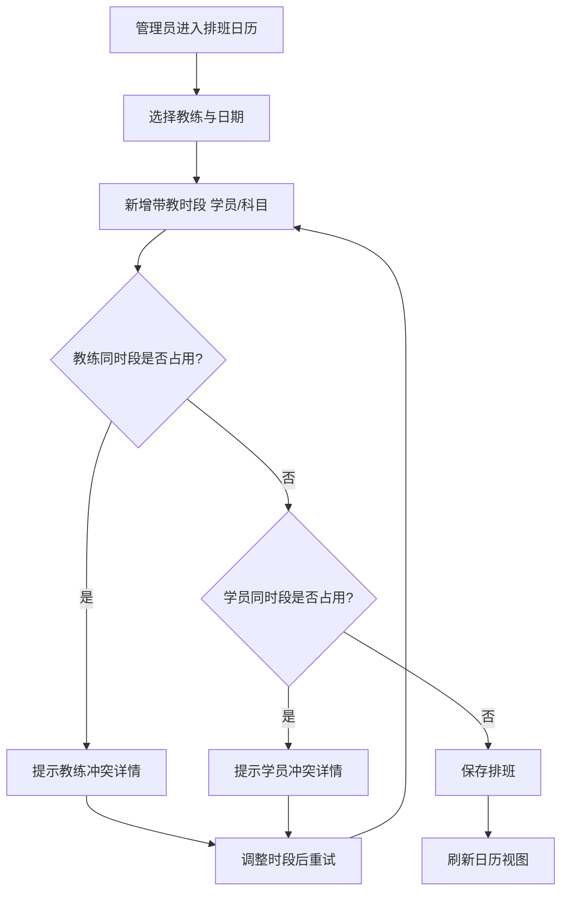
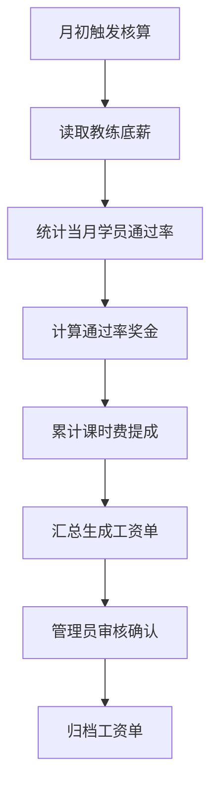
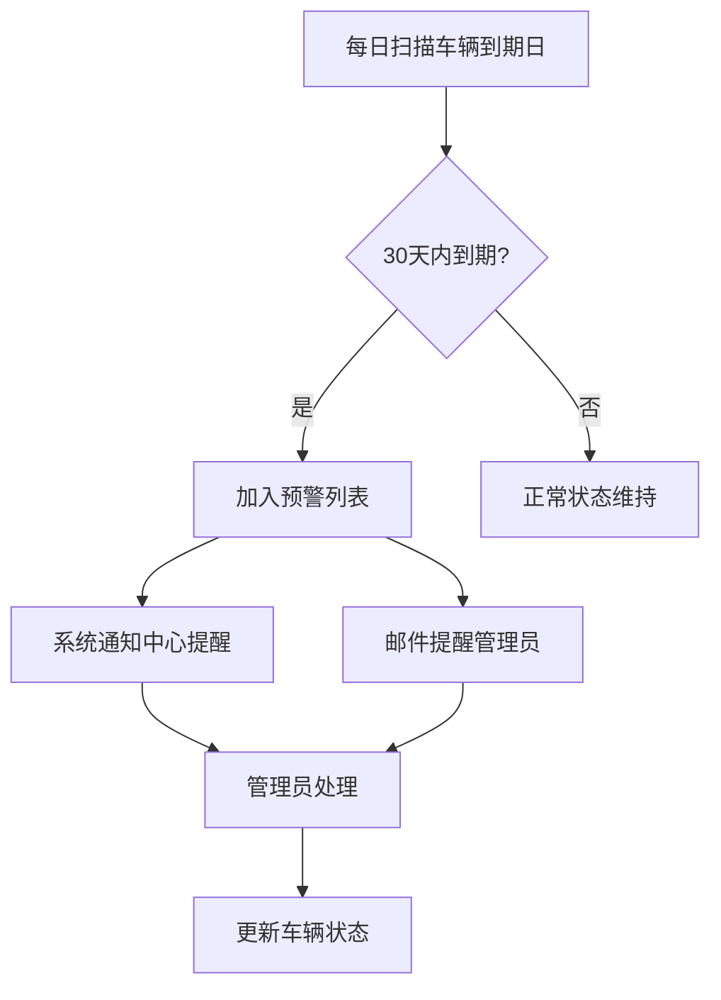

## 1. 产品概述

驾校总校与分校一体化管理平台是一套面向中大型驾校集团的全链路运营管理系统，覆盖分校运营、教练资源、车辆资产、财务收支与考试质量五大维度。系统以数据驱动决策为核心，帮助总校统一管控多分校、提升教练带教质量、保障车辆安全合规，并满足至少 10 个分校并发在线、页面 3 秒内加载的性能要求。

- 主要目的：统一总校与分校的数据口径，实现学员招收、教练排班、车辆调度、财务核算、考试合格率分析的一体化闭环管理。
- 解决问题：分校数据分散难统计、教练排班冲突频发、车辆年检保险易逾期、工资核算不透明、考试通过率难对比。
- 目标用户：总校管理员（全局管控）、分校管理员（本分校运营）、教练（查看排班与个人绩效）三类角色。

## 2. 核心功能

### 2.1 用户角色

| 角色 | 注册/开通方式 | 核心权限 |
|------|---------------------|------------------|
| 总校管理员 | 系统预置超级账号 | 全部模块的查看与管理，跨分校数据对比，系统配置与日志审计 |
| 分校管理员 | 总校管理员创建 | 仅本分校的学员/教练/车辆/财务/考试数据管理，本分校报表 |
| 教练 | 分校管理员创建 | 查看个人排班、个人学员、个人绩效与评价，不可查看财务 |

### 2.2 功能模块

1. **工作台总览**：全集团 KPI 卡片、分校通过率排行、车辆到期预警、营收趋势
2. **分校管理**：分校指标统计、通过率动态排名、分校运营仪表盘
3. **教练管理**：教练档案、月度通过率排行、学员评价、投诉记录
4. **教练排班**：每日带教时段分配、智能冲突检测、排班日历视图
5. **车辆管理**：车辆档案、保养记录、年检/保险到期提醒、车辆状态看板
6. **财务管理**：报名费收款确认、教练工资核算、分校月度营收对比
7. **考试合格率统计**：校区科二/科三排名、教练科二/科三排名、批次筛选对比
8. **系统管理**：用户与角色权限、操作日志审计

### 2.3 页面详情

| 页面名称 | 模块名称 | 功能描述 |
|-----------|-------------|---------------------|
| 登录页 | 账号登录 | 角色选择、账号密码登录、记住登录态 |
| 工作台总览 | KPI 概览卡片 | 学员总数、教练总数、车辆总数、本月营收等关键指标实时统计 |
| 工作台总览 | 分校通过率排行 | 各分校通过率横向排名条形图，支持科目筛选 |
| 工作台总览 | 到期预警面板 | 车辆年检/保险 30 天内到期列表，红色预警标识 |
| 工作台总览 | 营收趋势 | 近 6 个月营收折线趋势图 |
| 分校管理 | 分校指标统计表 | 各分校学员数、教练数、车辆数、通过率汇总表 |
| 分校管理 | 通过率动态排名 | 按科目（科一/科二/科三/科四）与时间段筛选的排行榜 |
| 分校管理 | 分校运营仪表盘 | 单分校数据可视化：学员构成、车辆状态、通过率趋势 |
| 教练管理 | 教练档案 | 基本信息、资质证书、执教年限、教练证等级、擅长科目 |
| 教练管理 | 月度通过率排行 | 多维度排序（通过率/带教学员数/评价分） |
| 教练管理 | 学员评价 | 评价平均分、评价标签、详细评价内容列表 |
| 教练管理 | 投诉记录 | 投诉内容、处理状态（待处理/处理中/已解决）、结果跟踪 |
| 教练排班 | 排班日历视图 | 月/周日历展示教练每日带教时段，颜色区分科目 |
| 教练排班 | 时段分配 | 手动新增/编辑带教时段，支持批量导入 |
| 教练排班 | 智能冲突检测 | 同一教练同时段重复安排、同一学员同时段冲突自动提示 |
| 车辆管理 | 车辆档案列表 | 品牌、车型、车牌、购买日期、年检有效期、保险到期、状态 |
| 车辆管理 | 保养记录 | 保养历史时间轴、新增保养记录、费用记录 |
| 车辆管理 | 到期提醒 | 年检/保险 30 天内到期红色预警、一键通知管理员 |
| 车辆管理 | 车辆状态看板 | 教学可用/故障维修/年检中状态标识与切换 |
| 财务管理 | 报名费收款 | 学员报名费收款确认，支付方式（现金/微信/支付宝/银行卡）记录 |
| 财务管理 | 教练工资核算 | 底薪 + 通过率奖金 + 课时费提成自动计算，工资单明细 |
| 财务管理 | 营收对比分析 | 分校月度营收柱状对比图、数据导出 |
| 考试合格率统计 | 校区合格率排名 | 各校区科二/科三一次性通过率排名，时间段/批次筛选 |
| 考试合格率统计 | 教练合格率排名 | 各教练科二/科三一次性通过率排名，时间段/批次筛选 |
| 系统管理 | 用户与角色 | 用户列表、角色权限分配、新增/停用用户 |
| 系统管理 | 操作日志 | 关键操作记录（操作人、时间、模块、动作、详情）可追溯 |

## 3. 核心流程

### 3.1 教练排班与冲突检测流程
管理员进入排班日历，选择教练与日期，新增带教时段并指定学员与科目；系统校验该教练同时段是否已有安排、该学员同时段是否已有安排；若冲突则弹窗提示冲突详情并阻止保存；无冲突则保存并刷新日历。

### 3.2 教练工资核算流程
每月初触发工资核算：读取教练底薪 → 统计当月学员通过率计算奖金 → 累计课时费提成 → 汇总生成工资单 → 管理员审核确认。

### 3.3 车辆到期提醒流程
系统每日扫描车辆年检与保险到期日；距到期 30 天内的车辆进入预警列表；系统通知中心与邮件提醒管理员；管理员处理后续保养/年检安排。

## 4. 用户界面设计

### 4.1 设计风格

- **主色调**：深松石绿 `#0F5C4E`（沉稳、可信、呼应道路标识绿），辅以暖琥珀金 `#D97706` 作为强调与预警点缀色；中性色采用暖灰系，避免冷冰冰的纯灰。
- **次色调**：成功绿 `#16A34A`、警示琥珀 `#F59E0B`、危险红 `#DC2626`、信息蓝 `#2563EB`，用于状态标识。
- **按钮风格**：主按钮实心圆角（6px）、次级按钮描边线框、危险按钮红色实心；hover 有轻微下沉阴影。
- **字体**：标题使用 `Smiley Sans` 风格的硬朗中文展示字体（通过系统字体栈 `PingFang SC / Microsoft YaHei` 兜底），数字与英文使用 `DIN` 风格字体提升数据感；正文使用 `PingFang SC / Microsoft YaHei`。
- **布局风格**：左侧固定侧边栏导航 + 顶部用户信息栏 + 主内容卡片化布局；数据密集页面采用表格 + 图表混排。
- **图标/Emoji**：使用 Element Plus 图标体系，配合状态色点（绿/黄/红圆点）表示车辆与流程状态。

### 4.2 页面设计概览

| 页面名称 | 模块名称 | UI 元素 |
|-----------|-------------|-------------|
| 登录页 | 登录卡片 | 左侧品牌视觉（深松石绿渐变 + 道路纹理装饰），右侧登录表单卡片，角色选择胶囊按钮 |
| 工作台总览 | KPI 卡片 | 4 列指标卡，数字大号 DIN 字体，环比箭头，悬浮微阴影 |
| 工作台总览 | 排行与预警 | 横向条形排行、红色预警列表带倒计时标签 |
| 分校管理 | 统计表与仪表盘 | 斑马纹表格 + 饼图/折线图组合，筛选下拉 |
| 教练管理 | 档案卡片 | 教练头像卡片网格，资质标签，评价星级 |
| 教练排班 | 日历视图 | 月历色块，时段彩色条，冲突红色高亮 |
| 车辆管理 | 档案与状态 | 车辆卡片含状态色条，保养时间轴 |
| 财务管理 | 收款与核算 | 收款弹窗、工资单表格、营收对比柱状图 |
| 系统管理 | 用户与日志 | 用户表格、角色标签、日志时间线 |

### 4.3 响应式设计

- 桌面优先（≥1200px）完整三栏/多列布局；平板（768-1199px）侧边栏折叠为图标模式、卡片自适应两列；移动端（<768px）单列堆叠、表格转为卡片式列表、图表简化。
- 触控优化：按钮点击区域 ≥44px，日历支持手势滑动切换月份。

## 5. 非功能性需求

- **权限管理**：基于角色的动态路由与按钮级权限控制，菜单按角色渲染。
- **操作日志**：增删改类关键操作记录操作人、时间、模块、动作、前后值摘要。
- **性能**：首屏加载 ≤3 秒，支持 10 个分校并发在线；前端路由懒加载、虚拟滚动表格。
- **数据导出**：财务与统计报表支持导出。
- **安全**：登录态 token 管理，接口鉴权，敏感操作二次确认。
