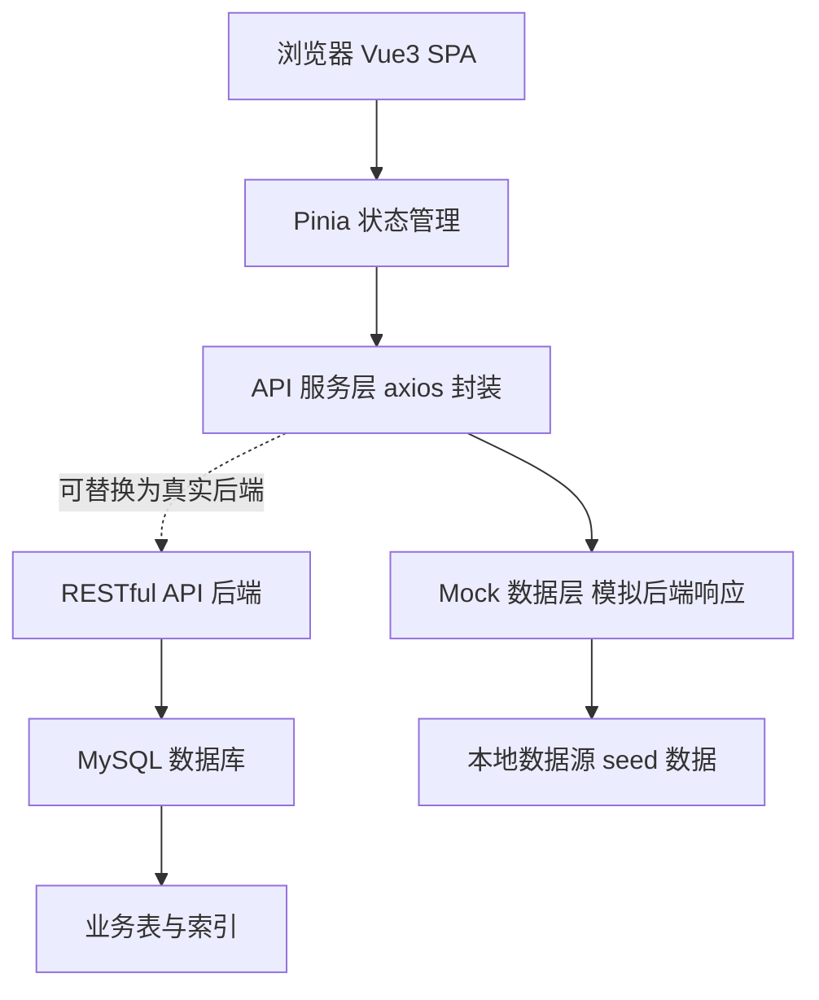
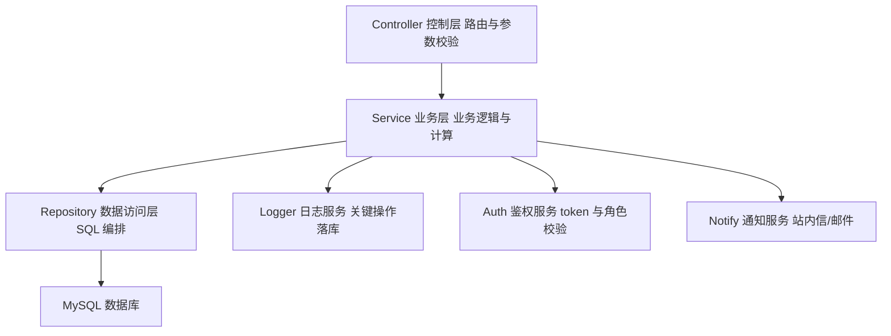
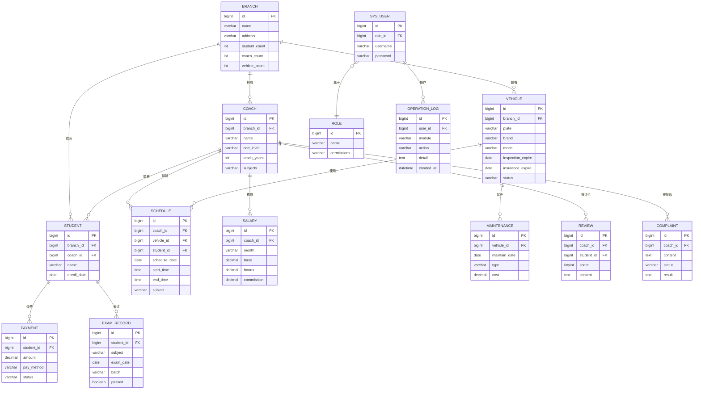

## 1. 架构设计

系统采用前后端分离架构。前端为 Vue3 + Element Plus 单页应用，通过 RESTful API 与后端交互；后端为 Node.js(Express) 风格的接口服务层；数据持久化使用 MySQL。在本交付版本中，后端以「Mock 服务层」形式内置于前端（使用 Pinia + 本地数据模拟接口响应），完整后端实现方案与 MySQL DDL 在本文档中给出，确保业务逻辑、数据结构与接口契约可直接迁移至真实后端。



## 2. 技术说明

- **前端**：Vue@3 + Element Plus + Vue Router@4 + Pinia + Vite + ECharts（图表） + unplugin-auto-import/unplugin-vue-components（按需引入）
- **初始化工具**：Vite 脚手架（`npm create vite@latest`）
- **后端**：本版本以 Mock 服务层模拟；真实后端推荐 Express@4 / NestJS，RESTful 风格
- **数据库**：MySQL 8.x（DDL 见第 6 节）
- **HTTP 客户端**：axios 封装统一请求/响应拦截、token 注入、错误处理
- **样式方案**：Element Plus 主题变量定制 + SCSS 变量系统 + CSS 变量

## 3. 路由定义

| 路由 | 页面名称 | 访问角色 |
|-------|---------|---------|
| `/login` | 登录页 | 公开 |
| `/` | 工作台总览 | 全部角色 |
| `/branch` | 分校管理-统计列表 | 总校管理员 |
| `/branch/dashboard/:id` | 分校运营仪表盘 | 总校管理员/分校管理员 |
| `/branch/ranking` | 通过率动态排名 | 总校管理员/分校管理员 |
| `/coach` | 教练档案 | 总校管理员/分校管理员 |
| `/coach/ranking` | 教练通过率排行 | 总校管理员/分校管理员 |
| `/coach/review` | 学员评价 | 总校管理员/分校管理员 |
| `/coach/complaint` | 投诉记录 | 总校管理员/分校管理员 |
| `/schedule` | 排班日历 | 总校管理员/分校管理员/教练 |
| `/vehicle` | 车辆档案 | 总校管理员/分校管理员 |
| `/vehicle/maintenance` | 保养记录 | 总校管理员/分校管理员 |
| `/vehicle/alert` | 到期提醒 | 总校管理员/分校管理员 |
| `/finance/payment` | 报名费收款 | 总校管理员/分校管理员 |
| `/finance/salary` | 教练工资核算 | 总校管理员/分校管理员 |
| `/finance/revenue` | 营收对比分析 | 总校管理员 |
| `/exam/branch` | 校区合格率排名 | 总校管理员/分校管理员 |
| `/exam/coach` | 教练合格率排名 | 总校管理员/分校管理员 |
| `/system/user` | 用户与角色 | 总校管理员 |
| `/system/log` | 操作日志 | 总校管理员 |

## 4. API 定义（RESTful 契约）

接口统一前缀 `/api`，统一响应结构：
```ts
interface ApiResponse<T> {
  code: number;     // 0 成功，非 0 失败
  message: string;
  data: T;
}
```

| 方法 | 路径 | 用途 |
|------|------|------|
| POST | `/api/auth/login` | 登录，返回 token 与角色信息 |
| GET | `/api/dashboard` | 工作台 KPI 汇总 |
| GET | `/api/branches` | 分校列表与统计指标 |
| GET | `/api/branches/:id/dashboard` | 分校运营仪表盘 |
| GET | `/api/branches/ranking` | 分校通过率排名，支持 subject/start/end 参数 |
| GET | `/api/coaches` | 教练档案列表 |
| POST | `/api/coaches` | 新增教练 |
| PUT | `/api/coaches/:id` | 编辑教练 |
| GET | `/api/coaches/ranking` | 教练月度通过率排行 |
| GET | `/api/coaches/:id/reviews` | 教练学员评价 |
| GET | `/api/coaches/:id/complaints` | 教练投诉记录 |
| POST | `/api/complaints/:id/resolve` | 处理投诉 |
| GET | `/api/schedules` | 排班列表，支持 coachId/date 参数 |
| POST | `/api/schedules` | 新增带教时段（含冲突检测） |
| POST | `/api/schedules/import` | 批量导入排班 |
| GET | `/api/schedules/check` | 冲突检测 |
| GET | `/api/vehicles` | 车辆档案列表 |
| PUT | `/api/vehicles/:id/status` | 更新车辆状态 |
| GET | `/api/vehicles/:id/maintenance` | 保养记录 |
| POST | `/api/vehicles/maintenance` | 新增保养记录 |
| GET | `/api/vehicles/alerts` | 年检/保险到期提醒 |
| GET | `/api/finance/payments` | 报名费收款记录 |
| POST | `/api/finance/payments/:id/confirm` | 确认收款 |
| GET | `/api/finance/salary` | 教练工资核算 |
| POST | `/api/finance/salary/calculate` | 触发核算 |
| GET | `/api/finance/revenue` | 分校月度营收对比 |
| GET | `/api/exam/branch-ranking` | 校区科二/科三合格率排名 |
| GET | `/api/exam/coach-ranking` | 教练科二/科三合格率排名 |
| GET | `/api/system/users` | 用户列表 |
| POST | `/api/system/users` | 新增用户 |
| PUT | `/api/system/users/:id` | 编辑用户/角色 |
| GET | `/api/system/logs` | 操作日志 |

## 5. 服务端架构图



## 6. 数据模型

### 6.1 数据模型定义



### 6.2 数据定义语言（DDL）

```sql
-- 分校表
CREATE TABLE branch (
  id BIGINT AUTO_INCREMENT PRIMARY KEY,
  name VARCHAR(64) NOT NULL COMMENT '分校名称',
  address VARCHAR(255) DEFAULT NULL COMMENT '地址',
  phone VARCHAR(32) DEFAULT NULL COMMENT '联系电话',
  created_at DATETIME DEFAULT CURRENT_TIMESTAMP,
  INDEX idx_name (name)
) ENGINE=InnoDB DEFAULT CHARSET=utf8mb4 COMMENT='分校';

-- 教练表
CREATE TABLE coach (
  id BIGINT AUTO_INCREMENT PRIMARY KEY,
  branch_id BIGINT NOT NULL COMMENT '所属分校',
  name VARCHAR(32) NOT NULL COMMENT '姓名',
  phone VARCHAR(32) DEFAULT NULL,
  gender TINYINT DEFAULT 1 COMMENT '1男2女',
  cert_no VARCHAR(64) DEFAULT NULL COMMENT '教练证号',
  cert_level VARCHAR(16) DEFAULT NULL COMMENT '教练证等级',
  teach_years INT DEFAULT 0 COMMENT '执教年限',
  subjects VARCHAR(64) DEFAULT NULL COMMENT '擅长科目',
  base_salary DECIMAL(10,2) DEFAULT 0 COMMENT '底薪',
  status TINYINT DEFAULT 1 COMMENT '1在职0离职',
  created_at DATETIME DEFAULT CURRENT_TIMESTAMP,
  INDEX idx_branch (branch_id)
) ENGINE=InnoDB DEFAULT CHARSET=utf8mb4 COMMENT='教练';

-- 车辆表
CREATE TABLE vehicle (
  id BIGINT AUTO_INCREMENT PRIMARY KEY,
  branch_id BIGINT NOT NULL,
  plate VARCHAR(16) NOT NULL COMMENT '车牌号',
  brand VARCHAR(32) NOT NULL COMMENT '品牌',
  model VARCHAR(32) DEFAULT NULL COMMENT '车型',
  purchase_date DATE DEFAULT NULL COMMENT '购买日期',
  inspection_expire DATE DEFAULT NULL COMMENT '年检有效期',
  insurance_expire DATE DEFAULT NULL COMMENT '保险到期日',
  status VARCHAR(16) DEFAULT 'available' COMMENT 'available/repair/inspecting',
  created_at DATETIME DEFAULT CURRENT_TIMESTAMP,
  UNIQUE KEY uk_plate (plate),
  INDEX idx_branch (branch_id),
  INDEX idx_inspection (inspection_expire),
  INDEX idx_insurance (insurance_expire)
) ENGINE=InnoDB DEFAULT CHARSET=utf8mb4 COMMENT='教练车';

-- 学员表
CREATE TABLE student (
  id BIGINT AUTO_INCREMENT PRIMARY KEY,
  branch_id BIGINT NOT NULL,
  coach_id BIGINT DEFAULT NULL,
  name VARCHAR(32) NOT NULL,
  phone VARCHAR(32) DEFAULT NULL,
  enroll_date DATE DEFAULT NULL COMMENT '报名日期',
  status VARCHAR(16) DEFAULT 'enrolled' COMMENT 'enrolled/training/examining/passed',
  created_at DATETIME DEFAULT CURRENT_TIMESTAMP,
  INDEX idx_branch (branch_id),
  INDEX idx_coach (coach_id)
) ENGINE=InnoDB DEFAULT CHARSET=utf8mb4 COMMENT='学员';

-- 排班表
CREATE TABLE schedule (
  id BIGINT AUTO_INCREMENT PRIMARY KEY,
  coach_id BIGINT NOT NULL,
  vehicle_id BIGINT DEFAULT NULL,
  student_id BIGINT DEFAULT NULL,
  schedule_date DATE NOT NULL,
  start_time TIME NOT NULL,
  end_time TIME NOT NULL,
  subject VARCHAR(16) DEFAULT NULL COMMENT '科目',
  created_at DATETIME DEFAULT CURRENT_TIMESTAMP,
  INDEX idx_coach_date (coach_id, schedule_date),
  INDEX idx_student_date (student_id, schedule_date),
  INDEX idx_date (schedule_date)
) ENGINE=InnoDB DEFAULT CHARSET=utf8mb4 COMMENT='教练排班';

-- 考试记录表
CREATE TABLE exam_record (
  id BIGINT AUTO_INCREMENT PRIMARY KEY,
  student_id BIGINT NOT NULL,
  branch_id BIGINT NOT NULL,
  coach_id BIGINT DEFAULT NULL,
  subject VARCHAR(16) NOT NULL COMMENT '科一/科二/科三/科四',
  exam_date DATE NOT NULL,
  batch VARCHAR(32) DEFAULT NULL COMMENT '考试批次',
  passed TINYINT DEFAULT 0 COMMENT '1通过0未通过',
  INDEX idx_branch (branch_id),
  INDEX idx_coach (coach_id),
  INDEX idx_subject_date (subject, exam_date)
) ENGINE=InnoDB DEFAULT CHARSET=utf8mb4 COMMENT='考试记录';

-- 报名费收款表
CREATE TABLE payment (
  id BIGINT AUTO_INCREMENT PRIMARY KEY,
  student_id BIGINT NOT NULL,
  branch_id BIGINT NOT NULL,
  amount DECIMAL(10,2) NOT NULL,
  pay_method VARCHAR(16) DEFAULT NULL COMMENT 'cash/wechat/alipay/card',
  status VARCHAR(16) DEFAULT 'pending' COMMENT 'pending/confirmed',
  confirmed_at DATETIME DEFAULT NULL,
  created_at DATETIME DEFAULT CURRENT_TIMESTAMP,
  INDEX idx_student (student_id),
  INDEX idx_branch_status (branch_id, status)
) ENGINE=InnoDB DEFAULT CHARSET=utf8mb4 COMMENT='报名费收款';

-- 工资表
CREATE TABLE salary (
  id BIGINT AUTO_INCREMENT PRIMARY KEY,
  coach_id BIGINT NOT NULL,
  branch_id BIGINT NOT NULL,
  month VARCHAR(7) NOT NULL COMMENT 'YYYY-MM',
  base_salary DECIMAL(10,2) DEFAULT 0,
  pass_bonus DECIMAL(10,2) DEFAULT 0 COMMENT '通过率奖金',
  commission DECIMAL(10,2) DEFAULT 0 COMMENT '课时费提成',
  total DECIMAL(10,2) DEFAULT 0,
  status VARCHAR(16) DEFAULT 'draft' COMMENT 'draft/confirmed',
  INDEX idx_coach_month (coach_id, month),
  INDEX idx_branch_month (branch_id, month)
) ENGINE=InnoDB DEFAULT CHARSET=utf8mb4 COMMENT='教练工资';

-- 保养记录表
CREATE TABLE maintenance (
  id BIGINT AUTO_INCREMENT PRIMARY KEY,
  vehicle_id BIGINT NOT NULL,
  maintain_date DATE NOT NULL,
  type VARCHAR(32) DEFAULT NULL COMMENT '保养类型',
  cost DECIMAL(10,2) DEFAULT 0,
  remark VARCHAR(255) DEFAULT NULL,
  INDEX idx_vehicle (vehicle_id)
) ENGINE=InnoDB DEFAULT CHARSET=utf8mb4 COMMENT='车辆保养';

-- 学员评价表
CREATE TABLE review (
  id BIGINT AUTO_INCREMENT PRIMARY KEY,
  coach_id BIGINT NOT NULL,
  student_id BIGINT DEFAULT NULL,
  score TINYINT NOT NULL COMMENT '1-5分',
  content TEXT,
  created_at DATETIME DEFAULT CURRENT_TIMESTAMP,
  INDEX idx_coach (coach_id)
) ENGINE=InnoDB DEFAULT CHARSET=utf8mb4 COMMENT='学员评价';

-- 投诉记录表
CREATE TABLE complaint (
  id BIGINT AUTO_INCREMENT PRIMARY KEY,
  coach_id BIGINT NOT NULL,
  student_id BIGINT DEFAULT NULL,
  content TEXT NOT NULL,
  status VARCHAR(16) DEFAULT 'pending' COMMENT 'pending/processing/resolved',
  result TEXT,
  created_at DATETIME DEFAULT CURRENT_TIMESTAMP,
  INDEX idx_coach_status (coach_id, status)
) ENGINE=InnoDB DEFAULT CHARSET=utf8mb4 COMMENT='教练投诉';

-- 角色表
CREATE TABLE role (
  id BIGINT AUTO_INCREMENT PRIMARY KEY,
  name VARCHAR(32) NOT NULL,
  permissions JSON DEFAULT NULL COMMENT '权限标识数组'
) ENGINE=InnoDB DEFAULT CHARSET=utf8mb4 COMMENT='角色';

-- 系统用户表
CREATE TABLE sys_user (
  id BIGINT AUTO_INCREMENT PRIMARY KEY,
  username VARCHAR(32) NOT NULL,
  password VARCHAR(128) NOT NULL,
  role_id BIGINT NOT NULL,
  branch_id BIGINT DEFAULT NULL COMMENT '分校管理员所属分校',
  status TINYINT DEFAULT 1,
  created_at DATETIME DEFAULT CURRENT_TIMESTAMP,
  UNIQUE KEY uk_username (username),
  INDEX idx_role (role_id)
) ENGINE=InnoDB DEFAULT CHARSET=utf8mb4 COMMENT='系统用户';

-- 操作日志表
CREATE TABLE operation_log (
  id BIGINT AUTO_INCREMENT PRIMARY KEY,
  user_id BIGINT DEFAULT NULL,
  username VARCHAR(32) DEFAULT NULL,
  module VARCHAR(32) DEFAULT NULL,
  action VARCHAR(32) DEFAULT NULL,
  detail TEXT,
  created_at DATETIME DEFAULT CURRENT_TIMESTAMP,
  INDEX idx_user (user_id),
  INDEX idx_module (module),
  INDEX idx_created (created_at)
) ENGINE=InnoDB DEFAULT CHARSET=utf8mb4 COMMENT='操作日志';

-- 初始角色数据
INSERT INTO role (id, name, permissions) VALUES
(1, '总校管理员', '["*"]'),
(2, '分校管理员', '["branch","coach","schedule","vehicle","finance","exam"]'),
(3, '教练', '["schedule:self","exam:self","coach:self"]');

-- 初始管理员账号
INSERT INTO sys_user (id, username, password, role_id, branch_id) VALUES
(1, 'admin', 'e10adc3949ba59abbe56e057f20f883e', 1, NULL);
```

## 7. 前端目录结构约定

```
src/
  api/              # 接口服务层（封装请求，本版本指向 mock）
  assets/           # 静态资源与主题样式
  components/       # 通用业务组件
  layout/           # 布局框架（侧边栏+顶栏）
  mock/             # Mock 数据与响应模拟
  router/           # 路由配置与权限守卫
  stores/           # Pinia 状态（auth/branch/coach...）
  utils/            # 工具（request/permission/format）
  views/            # 页面视图，按模块分目录
    dashboard/
    branch/
    coach/
    schedule/
    vehicle/
    finance/
    exam/
    system/
  App.vue
  main.ts
```

## 8. 权限与日志实现约定

- **动态路由**：登录后根据角色 permissions 过滤路由表，使用 `router.addRoute` 注入；侧边栏菜单按过滤结果渲染。
- **按钮级权限**：自定义指令 `v-permission`，校验操作码是否在角色权限集合内。
- **操作日志**：在 mock 服务层或真实后端拦截写操作，落库 `operation_log`，前端日志页读取展示。
